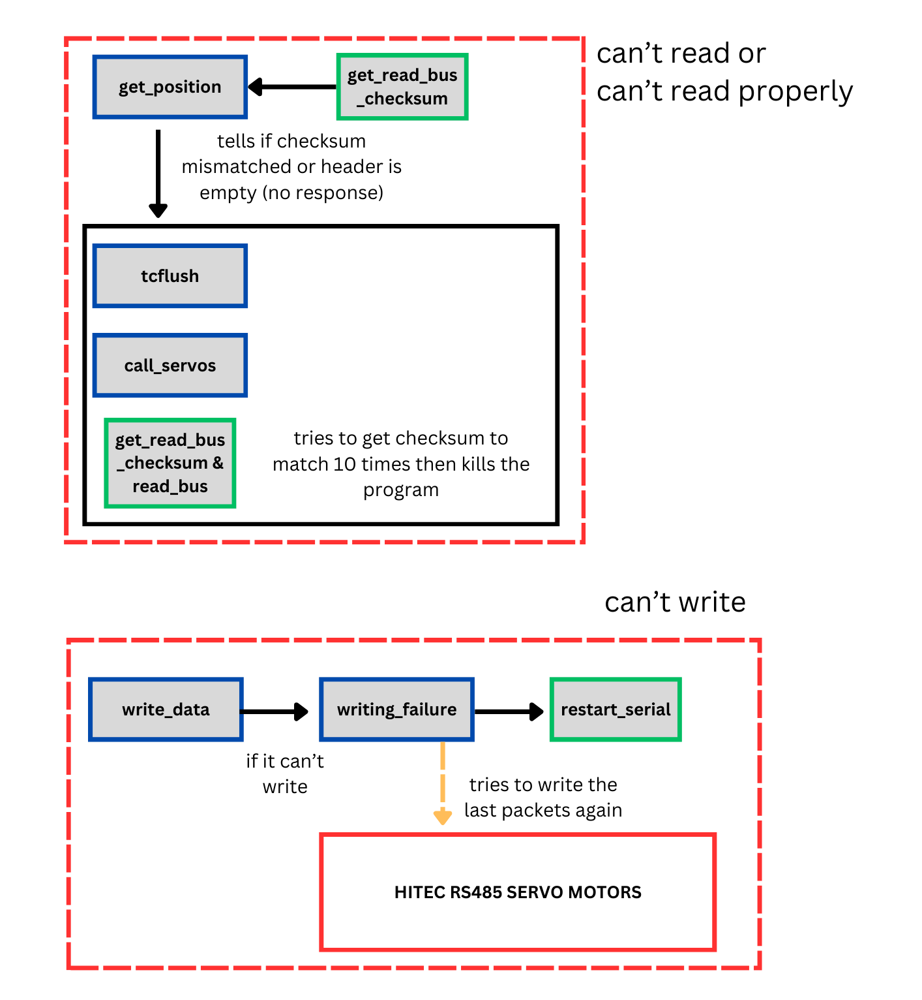

This README on the HITEC_RS485 github repository, is intended to people working on PERSEUS. This library enables to control the MD950TW-RS485 servo motors for the control of Jet Vaves.  These motors are controllable with a RS485 bus following registers made by HITEC, the code is valide for a FTDI (converts USB to RS485) or SMD UART/RS485 converters.

Be mindfull that the communication is in half duplex and please refer to the document "D series SERVO(TTL/ RS485) Protocol Manual"

# 🏢 Architecture of functions 
## 🈯 Schematic


## 🔌Setting up UART or USB
To be able to access UART or USB terminals within a C program on linux, a thermios structure is needed. Follow the excellent tutorial by mbedded.ninja to understand it fully
[click here](https://blog.mbedded.ninja/programming/operating-systems/linux/linux-serial-ports-using-c-cpp/#saving-termios)

Here are a key notes about the setup 
1. Pay attention to the two following attributes as they control how the reading function returns :
```c
tty.c_cc[VTIME] = 10;    // return as soon as 10ds has passed
tty.c_cc[VMIN] = 0
```
2. Keep baudrate at 115200
3. wiring_Pi is used when the UART/RS485 converter is used, as a directional pin
4. Pay attention to `unsigned long delay_after_request=10000;//10000 for uart/rs485 but 100000 for usb/rs485` as you need a little time to the servo for it to answer

## 🤯 HITEC MD Servos Subtleties

The HITEC can be very hard to understand sometimes, here are some things to keep in mind.
### 🧭 REG_POSITION
To get the position in the code, you might notice :
```c
current_positions[id]=(int16_t)(raw_position-b_coeff_encoders[id])/45.51;
//MD Series (360°): -90°=4096, 0°=depends on servo, 90°=12288.
```
This is because, every servo returns a different value for the 0° position, in the doc, it is written "(The MD Series servo may have different values around 0°.)"

To find what it is, given that the "REG_POSITION_MID" of the servo is 0°, send the servo to that position, and read the position to see what value returns the encoder.
```c
write_data(2,REG_POSITION_NEW,0x0B,0xB8);//sends second servo of the array to its MID position
read_data(2,REG_POSITION);
read_data(2,REG_POSITION_MID);
//the two readings are supposed to be the same
```

### ↪️ REG_POSITION_NEW
Giving the servo a target position depends on a linear function between REG_POSITION_MAX and MIN (take a look at the doc)

1. Read the value of the register REG_POSITION_MAX
2. Read the value of the register REG_POSITION_MIN
3. Put the value into your equation to read the position that you now have thanks to the previous step and get the value in degrees (in our case, it was -65° and +65)
4. Build your linear function thanks to these values
```c
int16_t reg_position_mid=0;//in degress
int16_t reg_position_min=-65;
int16_t reg_position_max=65;

bool servo_move(uint8_t servo, int16_t value){
	float slope=(float)(5600-400)/(reg_position_max-reg_position_min);
	float b_coeff=(float)5600-slope*reg_position_max;
	uint16_t raw_value=(uint16_t)value*slope+b_coeff;
	uint8_t data_low=raw_value;
	uint8_t data_high=raw_value >> 8;
	write_data(servo_id[servo],REG_POSITION_NEW,data_high,data_low);
	return true;	
}
```

## 📡 Broadcast
It is not possible to broadcast with these servo motors. By default, the ID of a servo is 0x00, you can change it by using the write formula (REG_ID) and then by saving the information to flash memory (REG_CONFIG_SAVE )

If you request an answer of all servos on a bus using the 0x00 address, they will all answer at the same time and the program won't be able to read all bytes and checksum errors will appear.

### ⏱️ REG_VELOCITY_MAX
You can change the value of the velocity by setting the value between 0 and 10, 10 and above is the max speed
```c
bool change_speed(uint8_t id, uint8_t value){
	write_data(servo_id[id],REG_VELOCITY_MAX,0x00, value);
	usleep(20000);
	return 1;
}
```

## 👎 Dealing with failures
Here is how differents failures are detected and dealt with



# 🗣️ Talk with CAC and OBC

1. Change IP of PC to 192.168.1.1 with subnet mask 255.255.255.0
2. `ssh OBC@192.168.1.2`
3.  password : perseus

CAC for now :
1. Set IP of PC as 192.168.1.1
2. `ssh pi4@192.168.1.3`
3. password : pi

## 🌐 Give them Internet Access
1. Connect to them via above
2. Look for "Connexions Réseau" in windows toolbar and open it
3. Go to Wi-fi => "Modifier les paramètres de cette connexion" => "Partage" => check two boxes
4. It will change your IP and thus you'll loose connection, no worries
5. Change your IP again, connect and try ping google.com

⚠️ If in 3 the two boxes were already checked, uncheck them, check again and then go on with 4